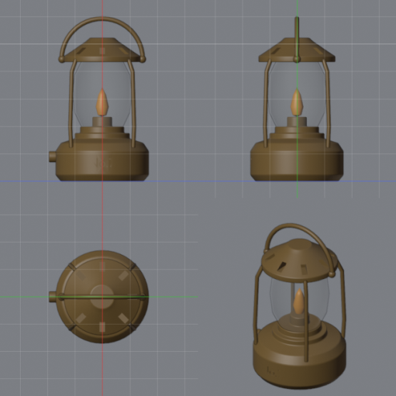

# bl-mcp

**Blender for AI agents, with numbers instead of guesses.** An MCP server plus a Blender add-on: 113 typed tools that build, measure, check, compare and render in a live Blender. Every tool answers with what it really did, and the mesh tools refuse instead of leaving an open or broken mesh.

Most Blender MCP servers give the agent one `execute_code` tool and a screenshot. That is enough to make something, and not enough to make it right: the agent cannot see 3D, and a part that sits 3 cm off produces no error. bl-mcp turns those mistakes into numbers and pictures the agent reads after every step.


| `render_sheet`: the overview the agent gets after each step | `compare_view`: reference, model, overlay, difference |
|---|---|
|  |  |

What the agent reads instead of a screenshot:

```
bevel_edges {"object": "lamp_base", "width": 0.002, "segments": 2}
{"bevelled": 480, "width": 0.002, "achieved_width": {"min": 0.002, "median": 0.002}, "clamped": 0, "tris": 2880}

find_floating {"names": [...9 parts], "ground_z": 0}
{"parts": 9, "connected_groups": 1, "floating": ["none"], "tiny_gaps": ["none"]}
```

The lantern was built, textured, lit and rendered by an agent through these tools. The run, with its numbers, is in [docs/demos.md](docs/demos.md).

## Contents

- [What it does](#what-it-does)
- [Where it comes from](#where-it-comes-from)
- [Install](#install)
- [Toolsets](#toolsets)
- [Recipes and the skill](#recipes-and-the-skill)
- [Documentation](#documentation): [tools](docs/tools.md), [limits](docs/limits.md), [demos](docs/demos.md), [comparison](docs/comparison.md), [development](docs/development.md)
- [License](#license)

## What it does

- **Builds in world units.** Primitives, profiles, lathe, sweep, arrays, booleans, bevels, sculpting by numbers. Metres, Z up, no hidden scale.
- **Measures and checks.** `measure`, `check_mesh`, `check_symmetry`, `find_floating`, `check_contacts`, `assert_spec` (a spec of sizes, ratios, gaps and symmetry the agent runs after every change).
- **Compares with references.** Masks and outlines from reference sheets, silhouette IoU per view with a band table and an overlay, automatic fit of parts, camera matching for photos.
- **Refuses to break the mesh.** `boolean` cleans and checks its result and tries other solvers; `weld` names a safe distance; `bevel_edges` reports the width it really achieved.
- **Ships to a game.** Materials with maps, procedural materials baked to textures, `check_game_ready`, GLB export with a texture size limit, inspection of the written file.
- **Levels.** Blockout from a text plan, walkability, routes, passage widths, sightlines, scatter, terrain.
- **Knows the workflow.** `recipe` serves step-by-step recipes (character, prop, weapon from a sheet, scene from a photo, level, materials, export) with the traps found in real agent sessions.
- **Stays usable.** Long tools run as background jobs in Blender; `checkpoint`, `diff_since` and `rollback` make experiments cheap.

## Where it comes from

bl-mcp was not designed as a tool catalogue. It grew while an agent built real game assets in Blender: a character from references, props, a pistol from an orthographic sheet, level blockouts for a game. Each round was an agent session, a report of where it fell back to raw Python or where a tool lied by omission, then changes to the tools and the next session. The recipes are the distilled logs of those sessions. Every tool has a headless test and a smoke call through the real server; tools no session needed were merged or removed. Details and numbers: [docs/demos.md](docs/demos.md).

## Install

Needs [`uv`](https://docs.astral.sh/uv/) and Blender 5.0 or newer.

1. Get the code: `git clone https://github.com/asedias/bl-mcp`.
2. Install the add-on: `uv run --project bl-mcp bl-mcp-install-addon`. It finds Blender, copies `addon/bl_bridge` into its add-ons folder and enables it (`--link` symlinks instead, so a `git pull` updates the add-on; `--blender PATH` picks a Blender). Restart Blender if it was open.
   By hand instead: the `bl_bridge-<version>.zip` of a [release](https://github.com/asedias/bl-mcp/releases) through Edit > Preferences > Add-ons > Install from Disk, or copy the folder into `~/Library/Application Support/Blender/<version>/scripts/addons/` (macOS) and enable **BL MCP Bridge**. The console prints `listening on 127.0.0.1:9877`.
3. Add the server to the MCP client. Claude Code:

```
claude mcp add blender -- uv run --project /path/to/bl-mcp bl-mcp
```

Any client with a JSON config:

```json
{
  "mcpServers": {
    "blender": {
      "type": "stdio",
      "command": "uv",
      "args": ["run", "--project", "/path/to/bl-mcp", "bl-mcp"]
    }
  }
}
```

The server alone also runs without a clone: `uvx --from git+https://github.com/asedias/bl-mcp bl-mcp`. The add-on still has to come from the repository, at the same version.

The agent calls `status` first. It shows both versions, compares the tools of the server with the handlers of the add-on, and says which side to restart when they differ. When Blender is not open it says where Blender is installed.

The server and the add-on talk by JSON lines on `127.0.0.1:9877`. Set `BL_MCP_PORT` on both sides to change the port.

**Security.** The add-on listens on localhost only, without authentication: any local process can connect and run `run_python`, which executes arbitrary Python inside your Blender. This is the purpose of the tool, and the same trust you give the MCP client. Do not run it on a shared machine, and keep the port closed in your firewall. `BL_MCP_NO_PYTHON=1` removes `run_python`: set it for the server (the tool disappears) and for Blender (the add-on refuses it), for pipelines where the agent may only use the typed tools. No data leaves the machine: there is no telemetry, no cloud service, no asset download.

## Toolsets

The server has 113 tools in 7 sets. All sets are on by default. Clients that load tool descriptions on demand (Claude Code, Codex) handle this well. For a client with a tool limit, pick the sets with `BL_MCP_TOOLSETS` (a comma list; `core` is always on):

```json
"env": { "BL_MCP_TOOLSETS": "core,model,reference,game" }
```

| Set | Tools | For |
|---|---|---|
| `core` | 32 | scene, measuring, placing, review renders, checks, checkpoints, recipes, `run_python` |
| `model` | 30 | mesh editing by selection, sculpting, booleans, arrays, lathe, sweep |
| `reference` | 11 | reference images and photos: masks, outlines, comparison, camera matching |
| `level` | 14 | blockout from a plan, walkability, routes, sightlines, terrain, scatter |
| `look` | 12 | materials, baking, lights, camera, world, final render |
| `rig` | 10 | armature, skinning, poses, UV, vertex colour |
| `game` | 4 | game checks, GLB export, import and inspection |
| `dev` | 1 | `reload_addon`; off unless named |

`status` lists the sets that are off with their tools. `bl_mcp/toolsets.py` is the table; the server refuses to start when a tool has no set.

## Recipes and the skill

The agent sees only the server instructions and the tool descriptions, so the workflow knowledge ships inside the package:

- `bl_mcp/recipes/`, served by the tool `recipe` (no argument lists the topics; `recipe(topic)` returns one with the general rules) and by the MCP prompts built from the same files. Topics: `rules`, `character-from-reference`, `prop-hard-surface`, `weapon-from-sheet`, `scene-from-photo`, `level-blockout`, `materials-and-render`, `export-for-game`.
- `skills/bl-mcp/SKILL.md` for Claude Code: when to use the server, how to start, the rules for every task. Copy the folder into `.claude/skills/` of a project or into `~/.claude/skills/`:

```
cp -r /path/to/bl-mcp/skills/bl-mcp .claude/skills/
```

The recipes stay in the server; the skill only points at them, so both never disagree.

## Documentation

| | |
|---|---|
| [docs/tools.md](docs/tools.md) | every tool by set, units and conventions, background jobs, how Blender is found |
| [docs/limits.md](docs/limits.md) | what the tools cannot do and the traps worth knowing |
| [docs/demos.md](docs/demos.md) | where the tools come from; the lantern demo with its call and token counts |
| [docs/comparison.md](docs/comparison.md) | bl-mcp next to mcp-for-blender, Blender Lab MCP and blender-ai-mcp |
| [docs/development.md](docs/development.md) | parts of the code, adding a tool, tests, CI and releases |

## License

MIT, see `LICENSE`.
