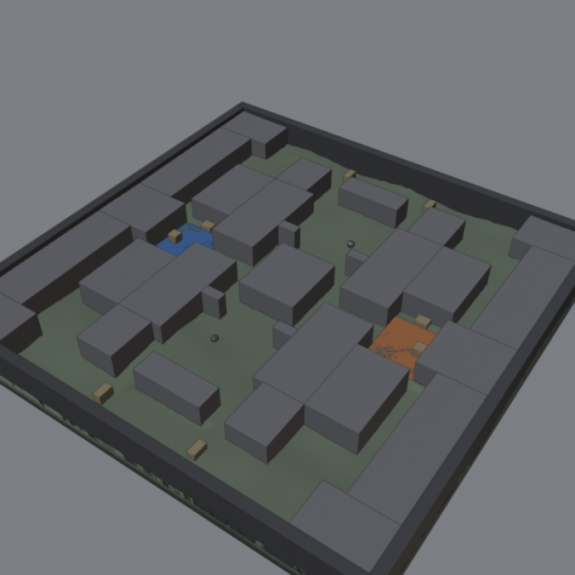
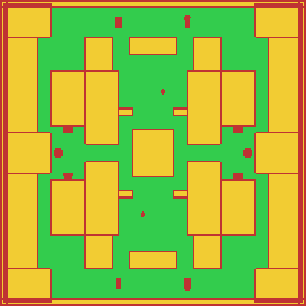
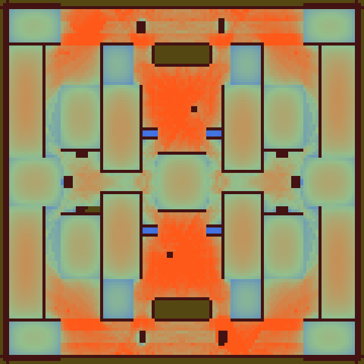
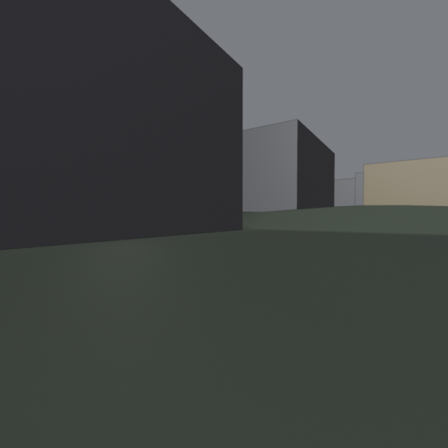

# Demos and where the tools come from

bl-mcp was not designed as a tool catalogue. It grew while an agent built real game assets in Blender: a character from front and side references, props, a pistol from an orthographic sheet, level blockouts for a game. Each round went the same way: an agent session, a report of where it fell back to raw Python, where a tool lied by omission and where the result was wrong without anyone noticing. Then the tools were changed and the next session ran against them. The recipes are the distilled logs of those sessions, traps included.

Every tool has a headless test of its handler and a smoke call through the real MCP server, and the server refuses to start when a tool has no toolset. Tools that no session needed were merged or removed.

## The lantern


| `render_sheet`: the overview the agent gets after each step | `compare_view`: reference, model, overlay, difference |
|---|---|
|  |  |

What the agent reads instead of a screenshot:

```
bevel_edges {"object": "lamp_base", "width": 0.002, "segments": 2}
{"bevelled": 480, "width": 0.002, "achieved_width": {"min": 0.002, "median": 0.002}, "clamped": 0, "tris": 2880}

find_floating {"names": [...9 parts], "ground_z": 0}
{"parts": 9, "connected_groups": 1, "floating": ["none"], "tiny_gaps": ["none"]}

compare_view {"reference": "lantern_front.png", "view": "front", "height_m": 0.301}
{"iou_registered": 0.8144, "worst_bands": [{"z0": 0, "z1": 0.025, "model_width": 0.196, "reference_width": 0.17, "delta_pct": 15.3, "verdict": "model wider"}]}
```

How to read it: the model's base was made 15 % too wide on purpose for this picture. A finished part reads 0.95 or more at this size; the band table says which height range is off, by how many metres and in which direction, so the next call is `set_dimensions` on that part, not a guess.

The lantern above was built, textured, lit and rendered by Claude Fable 5.1 through these tools in one session: 163 model calls, 106 tool calls, 18 k output tokens. The first version had a handle 3 mm above its pivots; `find_floating` now catches that before the render. The script is `tests/readme_images.py`, the scene is `demo/lantern.blend`.

## The level blockout

A smaller model, Gemini 3.8 Flash through `tests/agent_run.py`, got a text brief for an outdoor two-site competitive map: 90 by 90 m of terrain, two spawns, two bomb sites, chokepoints 3 to 5 m wide, and a list of checks it had to pass by number. 137 model calls, 218 tool calls, 1 tool error, with the `core`, `level` and `game` toolsets.



| `walkable_map`: reachable floor from T spawn | `sightline_map`: exposure, red is a long sight line |
|---|---|
|  |  |

What the checks said at the end:

```
route {"start": [0, -38, 1.6], "end": [24, 0, 1.6], "min_width": 3}
{"reachable": true, "length_m": 62.93, "straight_line_m": 45.08, "narrowest_m": 3.22, "narrowest_at": [7.43, -35.33, 1.2]}

walkable_map {"start": [0, -38, 1.6], "probe": [[0, -38], [24, 0], [0, 0]]}
{"probes": [{"at": [0, -38], "reachable": true, "free_width_m": 8.25}, {"at": [24, 0], "reachable": true, "free_width_m": 5.55},
            {"at": [0, 0], "walkable": true, "reachable": false, "floor_z": 0.95}]}

sightline_map {"long_sightline": 60}
{"area_with_a_sightline_over_60_m_m2": 0.0, "mean_sightline_m": 7.35}
```

Spawns 76 m apart, sites 52 m apart, the four spawn-to-site routes between 62 and 69 m with 3.1 m at the narrowest point, no line of sight between the spawns, a 15-check spec passed, `check_game_ready` true. The scene is `demo/blockout.blend`; `tests/readme_level_images.py` renders the pictures from it.



The run changed the tools. The agent read the add-on source through `run_python` to learn what an unreachable walkable region was (a roof) and why a 3 m route failed (the end point stood between covers): `walkable_map` now names the floor height of each region and has `probe`, `route` names the free width at both ends. Its eye-height views came out empty, because `render_view` framed a building from outside the map: `render_view` now has `eye`. A 90 m map broke `check_passages` at its fixed cell: the level tools now pick the cell from the scene size.
